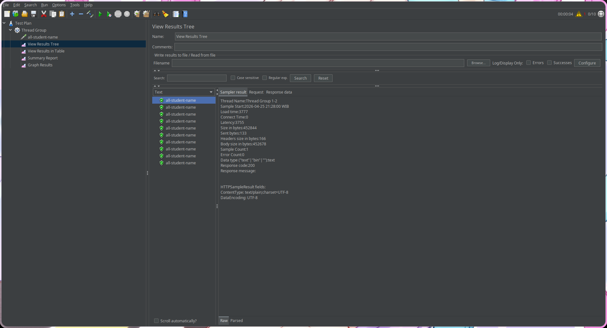
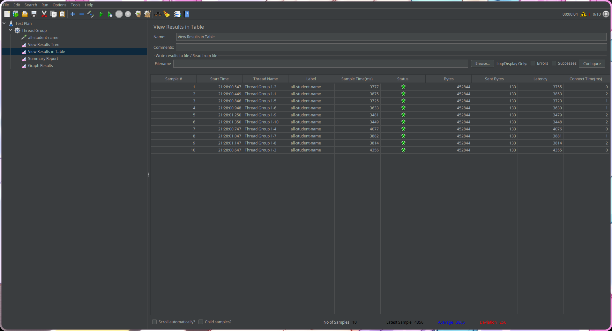
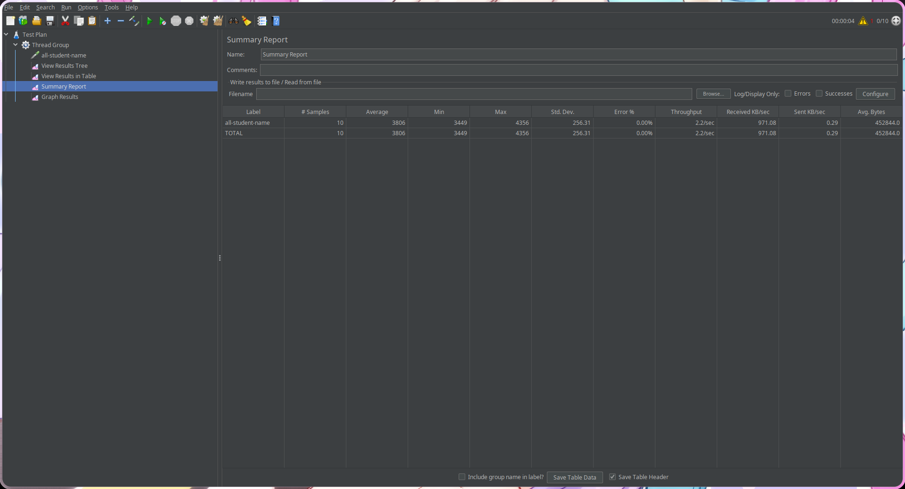
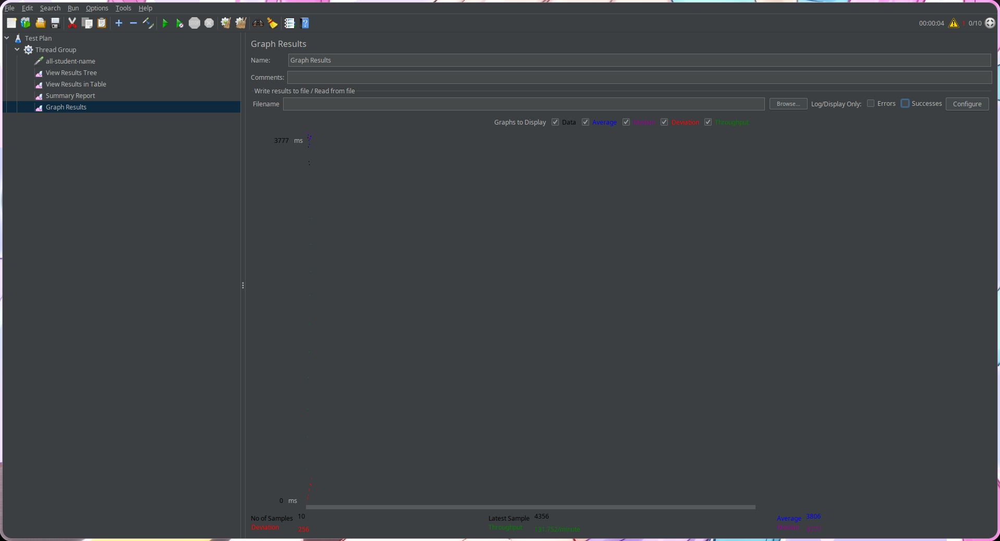
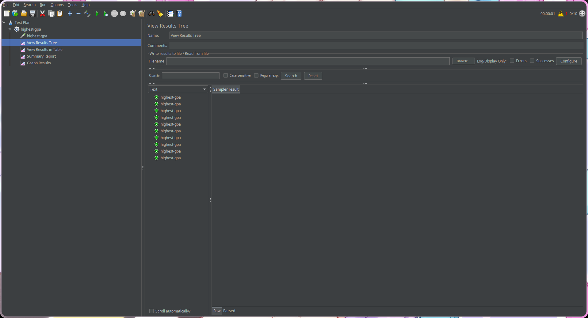
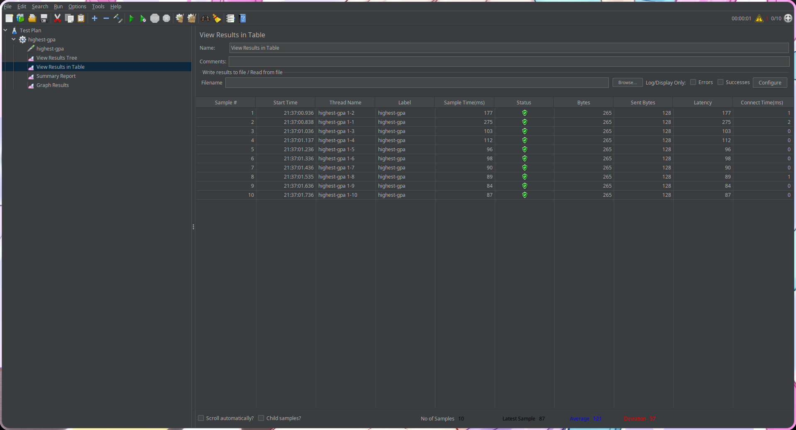
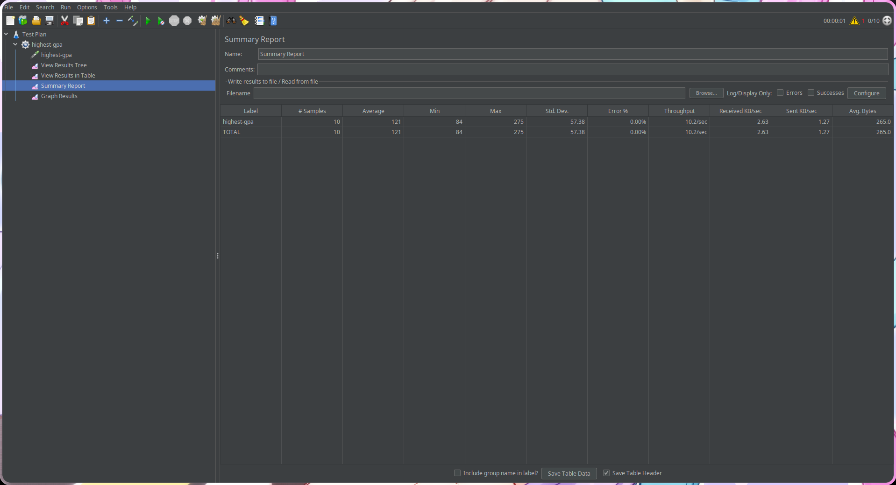
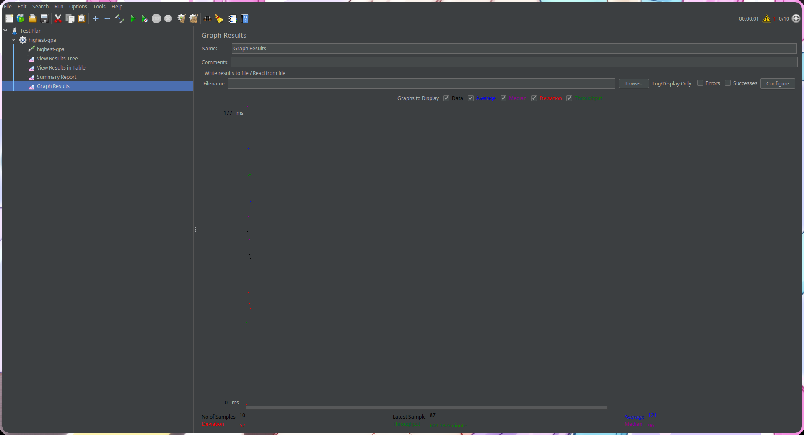
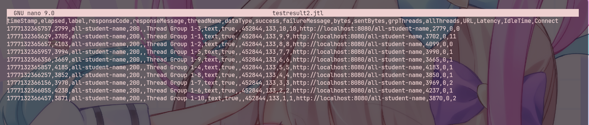
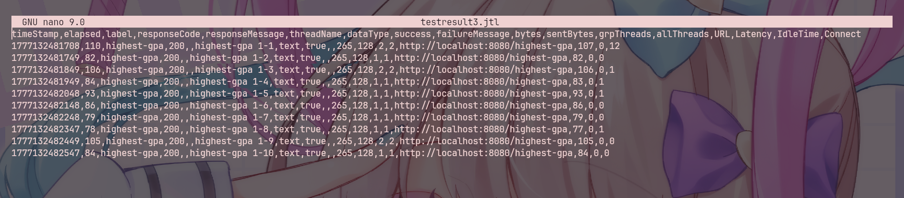

# Module 07: Java Profiling

# JMETER GUI

## all-student-name
### 1. View Results Tree

### 2. View Results in Table

### 3. Summary Report

### 4. Graph Results

## highest-gpa
### 1. View Results Tree

### 2. View Results in Table

### 3. Summary Report

### 4. Graph Results

# JMETER CLI

## all-student-name

## highest-gpa

# Kesimpulan JMeter

Setelah dilakukan profiling dan optimisasi kode, JMeter menunjukkan adanya peningkatan performance dibandingkan dengan pengukuran pertama. Endpoint yang dioptimisasi memiliki response time lebih cepat karena adanya pengurangan query database yang tidak penting serta pemrosesan memory yang tidak efisien. Pada kasus ini, aplikasi menjadi lebih cepat dan efisien ketika hanya melakukan query data yang benar-benar dibutuhkan dan membiarkan database menangani beberapa operasi seperti mencari GPA tertinggi. Sejauh ini, optimisasi telah meningkatkan performance aplikasi dan membantu menurunkan processing time pada endpoint yang diuji.